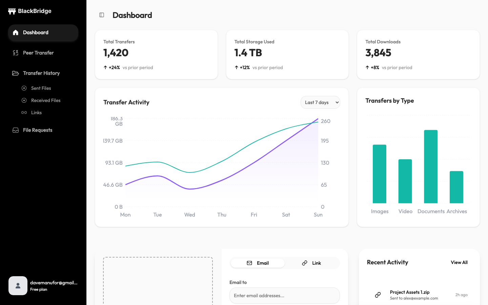
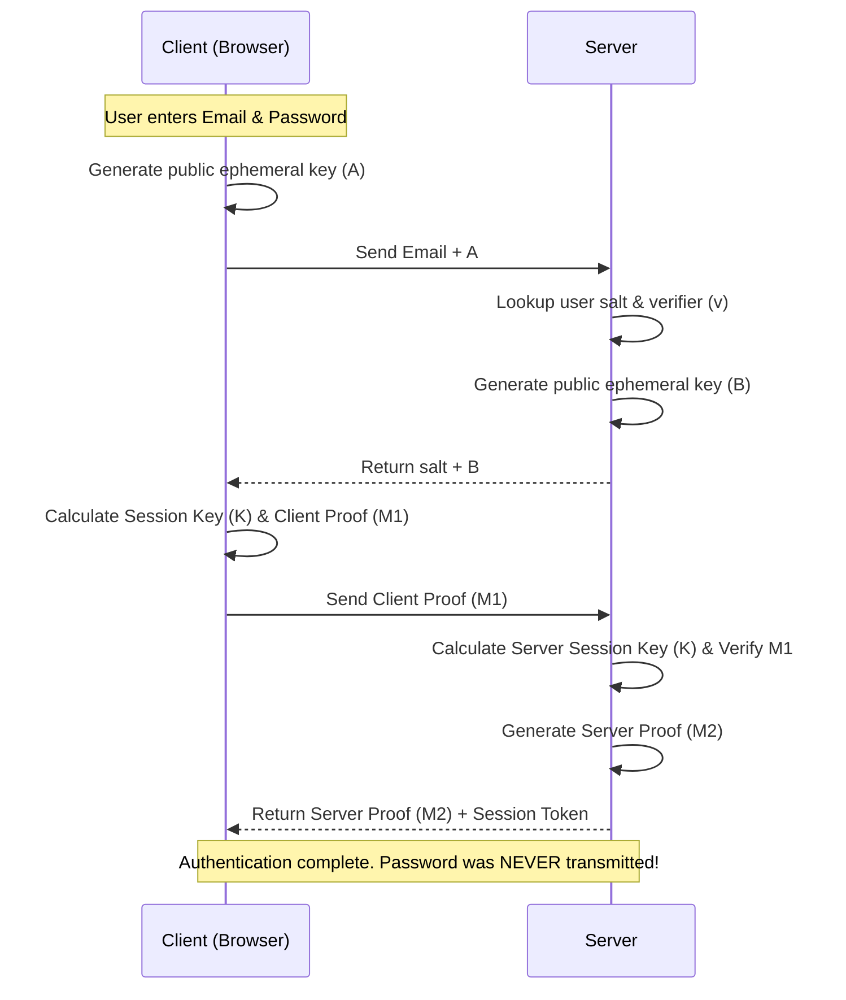
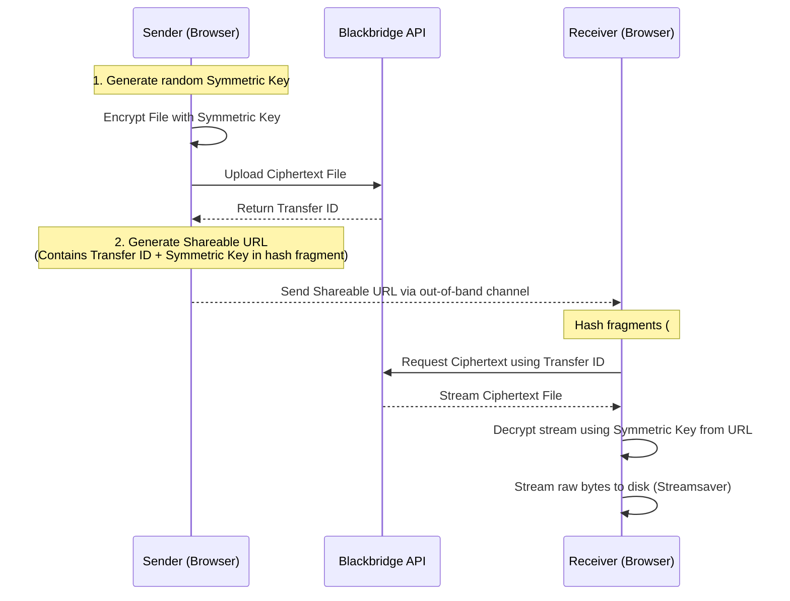
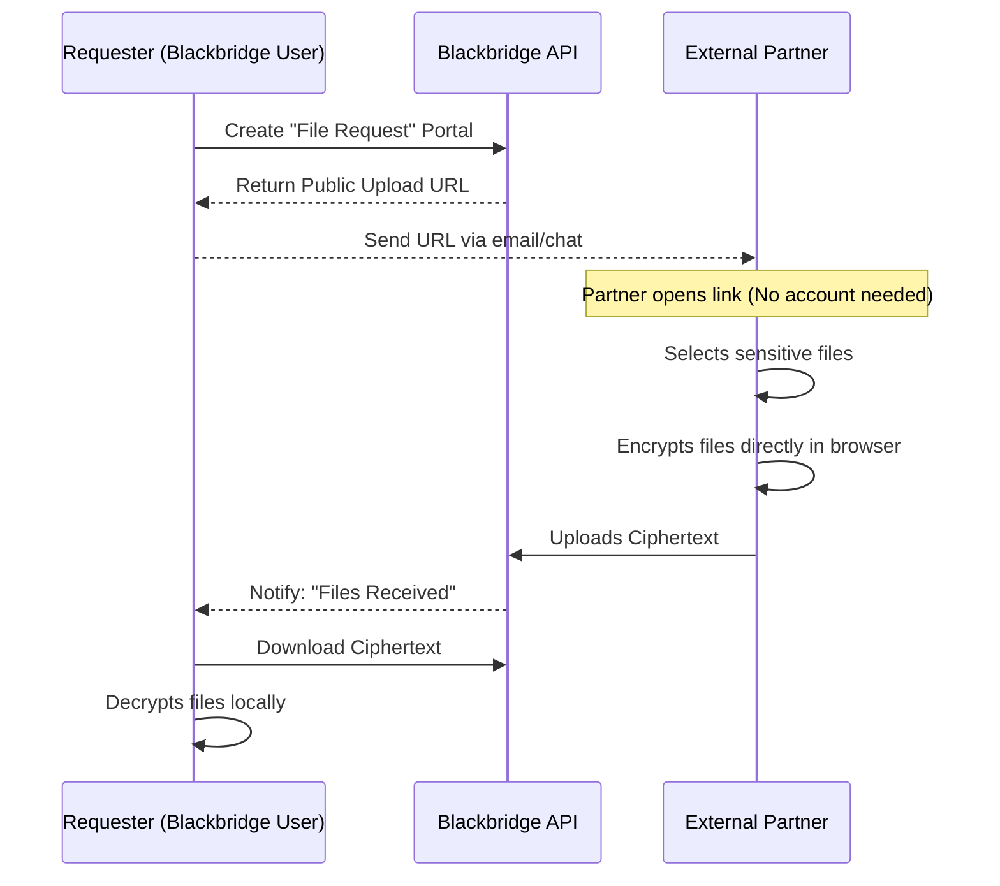
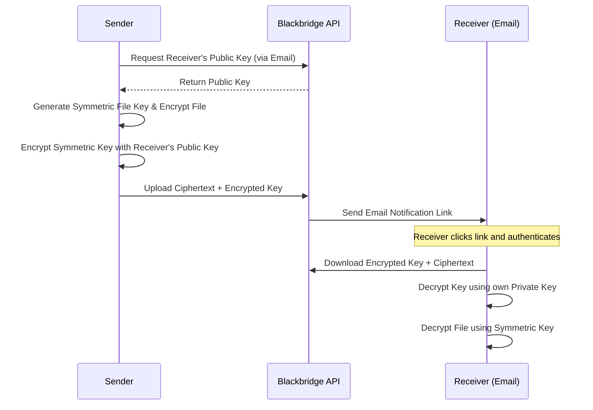
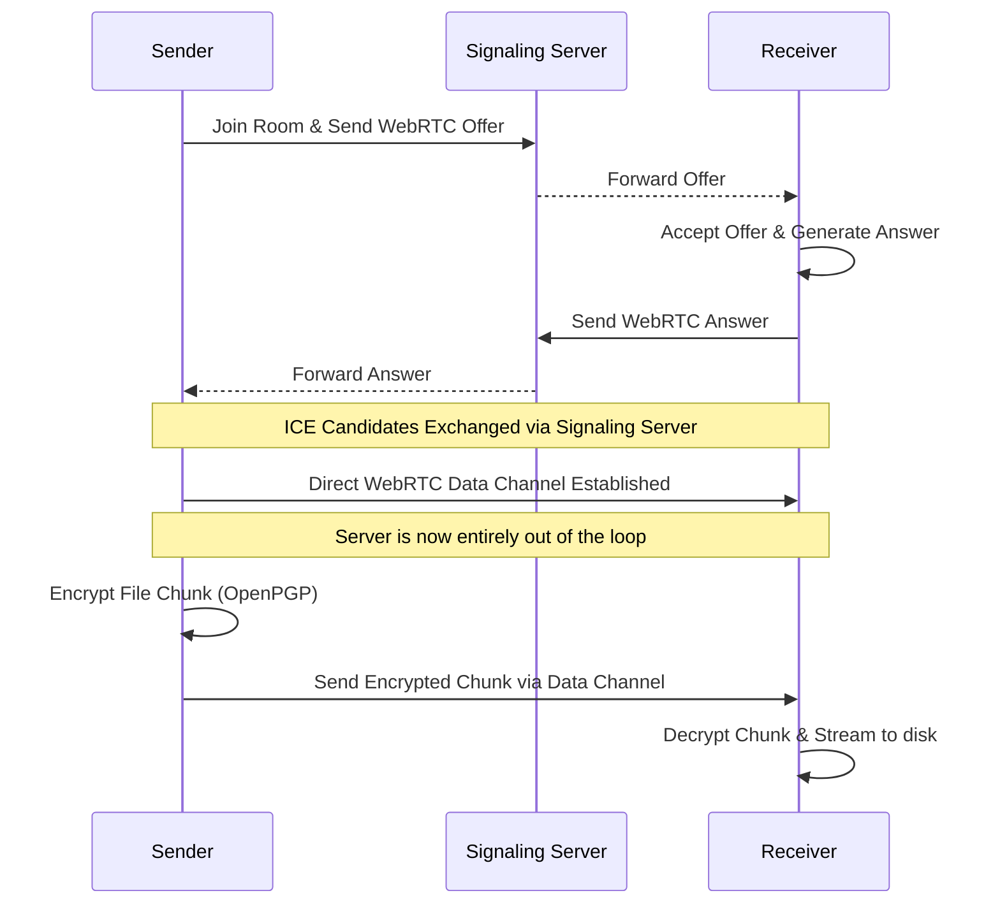
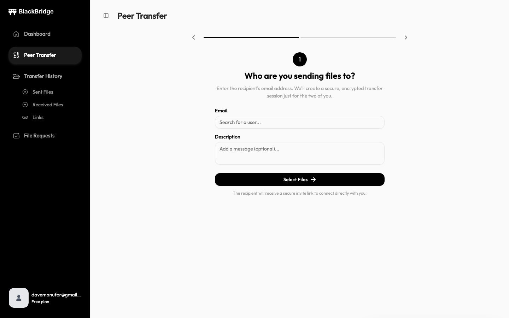

<div align="center">
  
  <h1>Blackbridge</h1>
  <p><b>A Zero-Knowledge, End-to-End Encrypted File Transfer Platform.</b></p>
  
  [](https://blackbridge-demo.davman.dev)
  [](#architecture--zero-knowledge-flow)
  [](#testing-methodology)
</div>

<br/>



Blackbridge is an enterprise-grade file transfer platform designed with a strict zero-knowledge architecture. Unlike traditional cloud storage that encrypts your data "at rest" (where the server holds the decryption keys), Blackbridge ensures that your files are **encrypted directly in your browser** before they ever leave your device. The server only handles ciphertext, meaning even in the event of a total database breach, your files remain mathematically secure.

---

## 🔒 Architecture & Zero-Knowledge Flow

Building a true zero-knowledge application requires overcoming two major hurdles: authenticating users without knowing their passwords, and encrypting massive files without crashing the browser.

### 1. Secure Remote Password (SRP) Protocol
Blackbridge utilizes the SRP protocol (`fast-srp-hap`) for authentication. When a user logs in:
- The plaintext password **never** leaves the browser.
- The client and server exchange cryptographic proofs to generate a shared session key.
- The server verifies the user's identity without ever storing or hashing the password.



### 2. Client-Side Encryption (OpenPGP + Web Workers)
All files are encrypted client-side using OpenPGP. To prevent the browser's main UI thread from freezing during heavy cryptographic operations, Blackbridge offloads encryption to background **Web Workers** via `comlink`.

### 3. Memory Optimization (Streamsaver)
Encrypting a 5GB file typically requires holding 5GB of data in RAM, causing Out-Of-Memory (OOM) crashes in the browser. Blackbridge solves this by streaming the ciphertext chunk-by-chunk and utilizing `streamsaver` to stream the decrypted bytes directly to the user's hard drive.

### The Cryptographic Handshake



### 4. Secure File Requests
Beyond sending files, Blackbridge allows users to request highly sensitive files from external partners via a secure, zero-knowledge inbox.



### 5. Email Sharing (Public Key Cryptography)
When sending a file directly to an email address, Blackbridge utilizes standard asymmetric public-key cryptography (OpenPGP) to ensure the server never sees the symmetric file key.



### 6. Peer-to-Peer (WebRTC)
For ultimate privacy and speed, users can transfer files directly to each other without the files ever touching the Blackbridge servers using WebRTC Data Channels.



---

## 📸 Interface



## 🛠️ Tech Stack & Infrastructure

**Frontend**
- **Framework:** React 19, Vite
- **State & Data:** Zustand, TanStack React Query
- **Cryptography:** OpenPGP.js, `fast-srp-hap`
- **Performance:** Comlink (Web Workers), StreamSaver.js

**Backend**
- **Framework:** Node.js, Express 5
- **Database:** PostgreSQL via Prisma ORM
- **Caching & Rate Limiting:** Redis

**Infrastructure & DevOps**
- **IaC:** AWS provisioned via Terraform (Private VPC subnets, RDS, S3, CloudFront).
- **Security Posture:** 
  - `SameSite: Strict` JWT cookie enforcement to prevent CSRF.
  - Multi-stage Dockerfile builds utilizing non-root users (`node`) and pinned image digests.
  - Granular AWS S3 bucket policies and CloudFront signed URLs to prevent direct asset access.

---

## 🧪 Testing Methodology

Security applications require extreme confidence. Blackbridge employs multiple testing layers to guarantee cryptographic integrity:

### Playwright E2E Testing
Located in `/e2e`, the Playwright suite treats the application as a black box. It spawns **two isolated browser contexts** simultaneously to simulate the zero-knowledge flow:
1. **Context A (Sender)** uploads an encrypted file and captures the sharing link.
2. **Context B (Receiver)** opens the link, downloads, and decrypts the file.
3. The test asserts that the raw bytes match perfectly, mathematically proving the E2EE flow works without data corruption.

### Vitest Unit Testing
The core cryptographic service layer (`KeyStore`, `SRP`, `CryptoBridge`) is covered by a robust Vitest suite to ensure key generation and session proofs perform deterministically.

---

## 🚀 Getting Started Locally

### Prerequisites
- Node.js (v20+)
- PostgreSQL
- Redis
- AWS Account (for S3 and CloudFront)

### Installation

1. **Clone the repository:**
   ```bash
   git clone https://github.com/dave-manufor/blackbridge-app.git
   cd blackbridge-app
   ```

2. **Backend Setup:**
   ```bash
   cd backend
   npm install
   cp .env.example .env # Ensure AWS, DB, and Redis vars are set
   npm run db:push
   npm run dev
   ```

3. **Frontend Setup:**
   ```bash
   cd ../frontend
   npm install
   npm run dev
   ```

### Running Tests
To execute the End-to-End testing suite against a fresh, isolated local test database:
```bash
cd e2e
npm run test
```

---

<div align="center">
  <i>Engineered with security and performance in mind.</i><br/>
  <b>License: ISC</b>
</div>
